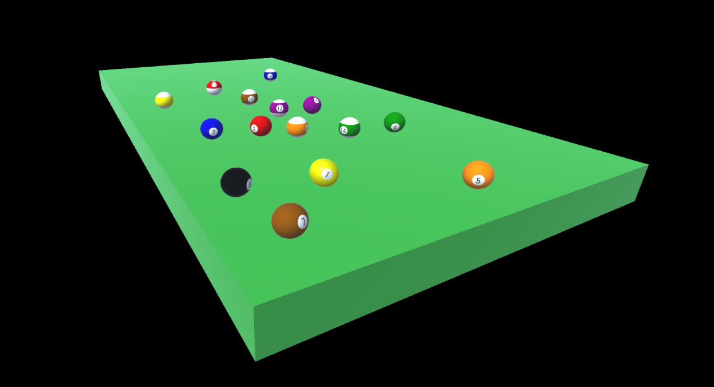

# 3D Graphics Project

## Overview
This is a comprehensive 3D graphics rendering application developed in **C++** using **OpenGL**, **GLFW**, **GLEW**, and **GLM** libraries. It demonstrates core concepts of 3D programming, including object rendering, camera control, lighting, shader programming, and basic animation. The project simulates a 3D snooker table environment with dynamic rendering of billiard balls and real-time interaction.

## Features
- **3D Object Rendering**: Utilizes OBJ models with corresponding MTL materials and textures.
- **Custom Shaders**: Written in GLSL for precise graphical effects.
- **Dynamic Lighting**: Supports four types of light sources:
  - **Ambient Light**
  - **Directional Light**
  - **Point Light**
  - **Spotlight**
- **Texture Mapping**: Applies realistic textures to 3D objects.
- **Camera Controls**: Rotate around the scene and zoom using mouse inputs.
- **Lighting Toggles**: Activate or deactivate individual light sources using the following keys:
  - `1` - Ambient Light
  - `2` - Directional Light
  - `3` - Point Light
  - `4` - Spotlight
- **Animation Trigger**: Press the `Space` key to animate a billiard ball, which stops upon collision with another ball or the table boundary.
- **Physics Simulation**: Implements collision detection and realistic ball movements.

  **Preview:**

- **Gustavo Barros**
- **Daniel Malheiro**
